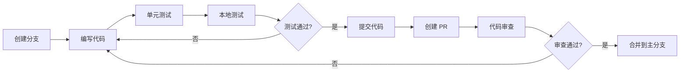

# CLIProxyAPI 开发指南

## 环境搭建

### 前置要求

- **Go**: 1.24.0 或更高版本
- **Git**: 用于版本控制
- **Docker** (可选): 用于容器化部署

### 克隆项目

```bash
git clone https://github.com/router-for-me/CLIProxyAPI.git
cd CLIProxyAPI
```

### 安装依赖

```bash
go mod download
```

### 配置文件

复制示例配置文件并修改：

```bash
cp config.example.yaml config.yaml
```

编辑 `config.yaml`，至少配置以下内容：

```yaml
port: 8317
auth-dir: "~/.cli-proxy-api"
api-keys:
  - "your-api-key-here"
debug: true
```

## 快速开始

### 1. 运行服务

```bash
go run cmd/server/main.go -config config.yaml
```

### 2. OAuth 登录（以 OpenAI 为例）

```bash
go run cmd/server/main.go -openai-login -config config.yaml
```

这会打开浏览器完成 OAuth 认证流程。

### 3. 测试 API

```bash
curl http://localhost:8317/v1/chat/completions \
  -H "Content-Type: application/json" \
  -H "Authorization: Bearer your-api-key-here" \
  -d '{
    "model": "gpt-4",
    "messages": [{"role": "user", "content": "Hello!"}]
  }'
```

## 开发流程

### 项目结构导航

```
CLIProxyAPI/
├── cmd/server/         # 应用程序入口
│   └── main.go        # 主函数，处理命令行参数
├── internal/          # 内部实现（不导出）
│   ├── api/          # HTTP API 服务器
│   ├── auth/         # 认证模型
│   ├── translator/   # 协议转换器实现
│   ├── store/        # 存储实现
│   └── ...
├── sdk/              # 可导出的 SDK
│   ├── cliproxy/    # 核心服务 SDK
│   ├── auth/        # 认证 SDK
│   ├── translator/  # 翻译器框架
│   └── api/         # API 处理器
└── examples/        # 示例代码
```

### 开发工作流



## 核心模块开发

### 1. 自定义翻译器

翻译器用于在不同 AI 服务的请求/响应格式之间转换。

#### 步骤 1: 定义翻译器

```go
package mytranslator

import (
    "context"
    "encoding/json"
    
    "github.com/router-for-me/CLIProxyAPI/v6/sdk/translator"
)

// MyRequestTranslator 将源格式转换为目标格式
type MyRequestTranslator struct{}

func (t *MyRequestTranslator) Translate(ctx context.Context, input []byte) ([]byte, error) {
    var sourceReq SourceRequest
    if err := json.Unmarshal(input, &sourceReq); err != nil {
        return nil, err
    }
    
    // 执行转换逻辑
    targetReq := TargetRequest{
        Model: sourceReq.Model,
        // ... 其他字段映射
    }
    
    return json.Marshal(targetReq)
}

func (t *MyRequestTranslator) Protocol() translator.Protocol {
    return translator.Protocol{
        Input:  "source_protocol",
        Output: "target_protocol",
    }
}
```

#### 步骤 2: 注册翻译器

```go
package mytranslator

import (
    "github.com/router-for-me/CLIProxyAPI/v6/sdk/translator"
)

func init() {
    translator.RegisterRequestTranslator(
        "source_protocol",
        "target_protocol",
        "endpoint_name",
        &MyRequestTranslator{},
    )
    
    translator.RegisterResponseTranslator(
        "target_protocol",
        "source_protocol",
        "endpoint_name",
        &MyResponseTranslator{},
    )
}
```

#### 步骤 3: 导入翻译器

在 `internal/translator/init.go` 中添加：

```go
import (
    _ "github.com/router-for-me/CLIProxyAPI/v6/internal/translator/mytranslator"
)
```

### 2. 自定义认证器

认证器用于实现特定 AI 服务的 OAuth 登录流程。

#### 步骤 1: 实现 Authenticator 接口

```go
package myauth

import (
    "context"
    
    "github.com/router-for-me/CLIProxyAPI/v6/internal/config"
    "github.com/router-for-me/CLIProxyAPI/v6/sdk/auth"
    coreauth "github.com/router-for-me/CLIProxyAPI/v6/sdk/cliproxy/auth"
)

type MyAuthenticator struct{}

func (a *MyAuthenticator) Provider() string {
    return "myprovider"
}

func (a *MyAuthenticator) Login(
    ctx context.Context,
    cfg *config.Config,
    opts *auth.LoginOptions,
) (*coreauth.Auth, error) {
    // 实现 OAuth 登录流程
    // 1. 生成授权 URL
    // 2. 打开浏览器
    // 3. 等待回调
    // 4. 交换 access_token
    // 5. 返回 Auth 对象
    
    return &coreauth.Auth{
        ID:           "unique_id",
        Provider:     "myprovider",
        AccessToken:  "access_token",
        RefreshToken: "refresh_token",
        // ... 其他字段
    }, nil
}
```

#### 步骤 2: 注册认证器

```go
func init() {
    defaultManager := auth.GetDefaultManager()
    defaultManager.Register(&MyAuthenticator{})
}
```

### 3. 自定义处理器

自定义处理器用于支持新的 API 端点。

#### 示例: 自定义模型列表处理器

```go
package handlers

import (
    "net/http"
    
    "github.com/gin-gonic/gin"
    "github.com/router-for-me/CLIProxyAPI/v6/sdk/api/handlers"
)

func (h *BaseAPIHandler) HandleCustomModels(c *gin.Context) {
    models := h.GetAvailableModels()
    
    c.JSON(http.StatusOK, gin.H{
        "object": "list",
        "data":   models,
    })
}
```

#### 注册路由

在 `internal/api/server.go` 的 `setupRoutes` 方法中：

```go
func (s *Server) setupRoutes() {
    // ... 其他路由
    
    v1 := s.engine.Group("/v1")
    v1.GET("/custom/models", s.handlers.HandleCustomModels)
}
```

### 4. 自定义存储后端

#### 实现 Store 接口

```go
package mystore

import (
    "context"
    
    coreauth "github.com/router-for-me/CLIProxyAPI/v6/sdk/cliproxy/auth"
)

type MyStore struct {
    // 存储配置
}

func (s *MyStore) Save(ctx context.Context, auth *coreauth.Auth) (string, error) {
    // 保存认证信息
    return "saved_path", nil
}

func (s *MyStore) Load(ctx context.Context) ([]*coreauth.Auth, error) {
    // 加载所有认证信息
    return auths, nil
}

func (s *MyStore) Delete(ctx context.Context, id string) error {
    // 删除认证信息
    return nil
}

func (s *MyStore) LoadByID(ctx context.Context, id string) (*coreauth.Auth, error) {
    // 根据 ID 加载
    return auth, nil
}
```

#### 使用自定义存储

```go
import "github.com/router-for-me/CLIProxyAPI/v6/sdk/cliproxy"

store := &MyStore{}

service := cliproxy.NewBuilder().
    WithConfig(cfg).
    WithAuthManager(
        auth.NewManager(store),
    ).
    Build()
```

## 测试指南

### 单元测试

#### 测试翻译器

```go
package mytranslator_test

import (
    "context"
    "testing"
    
    "github.com/router-for-me/CLIProxyAPI/v6/internal/translator/mytranslator"
)

func TestMyTranslator_Translate(t *testing.T) {
    translator := &mytranslator.MyRequestTranslator{}
    
    input := []byte(`{"model":"gpt-4","messages":[]}`)
    output, err := translator.Translate(context.Background(), input)
    
    if err != nil {
        t.Fatalf("unexpected error: %v", err)
    }
    
    // 验证输出
    // ...
}
```

#### 运行测试

```bash
# 运行所有测试
go test ./...

# 运行特定包的测试
go test ./internal/translator/...

# 运行测试并显示覆盖率
go test -cover ./...

# 生成覆盖率报告
go test -coverprofile=coverage.out ./...
go tool cover -html=coverage.out
```

### 集成测试

创建 `test/integration_test.go`:

```go
package test

import (
    "context"
    "net/http"
    "testing"
    
    "github.com/router-for-me/CLIProxyAPI/v6/internal/config"
    "github.com/router-for-me/CLIProxyAPI/v6/sdk/cliproxy"
)

func TestE2E_ChatCompletions(t *testing.T) {
    // 1. 启动服务
    cfg := &config.Config{
        Port: 18317,
        // ... 配置
    }
    
    service, err := cliproxy.NewBuilder().
        WithConfig(cfg).
        WithConfigPath("test-config.yaml").
        Build()
    if err != nil {
        t.Fatal(err)
    }
    
    ctx, cancel := context.WithCancel(context.Background())
    defer cancel()
    
    go service.Run(ctx)
    
    // 2. 发送测试请求
    resp, err := http.Post(
        "http://localhost:18317/v1/chat/completions",
        "application/json",
        // ... 请求体
    )
    
    // 3. 验证响应
    if resp.StatusCode != http.StatusOK {
        t.Errorf("expected 200, got %d", resp.StatusCode)
    }
    
    // 4. 关闭服务
    service.Shutdown(context.Background())
}
```

## 调试技巧

### 1. 启用调试日志

在 `config.yaml` 中设置：

```yaml
debug: true
logging-to-file: true
```

### 2. 使用 VSCode 调试

创建 `.vscode/launch.json`:

```json
{
  "version": "0.2.0",
  "configurations": [
    {
      "name": "Launch Server",
      "type": "go",
      "request": "launch",
      "mode": "auto",
      "program": "${workspaceFolder}/cmd/server",
      "args": ["-config", "config.yaml"],
      "env": {},
      "showLog": true
    }
  ]
}
```

### 3. 查看请求/响应日志

日志会记录所有请求和响应的详细信息：

```
INFO[0000] request started method=POST path=/v1/chat/completions
DEBUG[0000] request body: {"model":"gpt-4",...}
DEBUG[0001] response body: {"choices":[...],...}
INFO[0001] request completed status=200 latency=1.2s
```

### 4. 使用 Postman/cURL 测试

```bash
# 测试 OpenAI Chat Completions
curl -X POST http://localhost:8317/v1/chat/completions \
  -H "Content-Type: application/json" \
  -H "Authorization: Bearer your-api-key" \
  -d @test-request.json

# 测试流式响应
curl -N -X POST http://localhost:8317/v1/chat/completions \
  -H "Content-Type: application/json" \
  -H "Authorization: Bearer your-api-key" \
  -d '{"model":"gpt-4","messages":[{"role":"user","content":"Hello"}],"stream":true}'
```

## 性能优化

### 1. 连接池配置

```go
httpClient := &http.Client{
    Transport: &http.Transport{
        MaxIdleConns:        100,
        MaxIdleConnsPerHost: 10,
        IdleConnTimeout:     90 * time.Second,
    },
}
```

### 2. 并发限制

使用 semaphore 限制并发请求数：

```go
import "golang.org/x/sync/semaphore"

sem := semaphore.NewWeighted(10) // 最多 10 个并发请求

func handleRequest(ctx context.Context) {
    if err := sem.Acquire(ctx, 1); err != nil {
        return err
    }
    defer sem.Release(1)
    
    // 处理请求
}
```

### 3. 使用 pprof 性能分析

```go
import _ "net/http/pprof"

go func() {
    http.ListenAndServe("localhost:6060", nil)
}()
```

访问 `http://localhost:6060/debug/pprof/` 查看性能分析。

### 4. 内存优化

- 使用对象池减少内存分配
- 及时关闭响应体
- 避免不必要的数据复制

```go
var bufferPool = sync.Pool{
    New: func() interface{} {
        return new(bytes.Buffer)
    },
}

buf := bufferPool.Get().(*bytes.Buffer)
defer bufferPool.Put(buf)
```

## 安全实践

### 1. API Key 安全

```yaml
# 不要在代码中硬编码 API Key
# 使用环境变量或配置文件
api-keys:
  - ${API_KEY_1}
  - ${API_KEY_2}
```

### 2. Token 存储

确保 token 文件权限正确：

```bash
chmod 600 ~/.cli-proxy-api/*/account*.json
```

### 3. HTTPS 部署

在生产环境中启用 TLS：

```yaml
tls:
  enable: true
  cert: "/path/to/cert.pem"
  key: "/path/to/key.pem"
```

### 4. 管理 API 安全

```yaml
remote-management:
  allow-remote: false  # 仅允许 localhost
  secret-key: "strong-secret-key"  # 使用强密钥
```

## 发布流程

### 1. 版本标记

```bash
git tag v6.1.0
git push origin v6.1.0
```

### 2. 构建二进制

使用 GoReleaser:

```bash
goreleaser release --clean
```

### 3. Docker 镜像

```bash
# 构建镜像
docker build -t cliproxy-api:v6.1.0 .

# 推送到 Docker Hub
docker push cliproxy-api:v6.1.0
```

### 4. 发布说明

在 GitHub Releases 中添加发布说明：

- 新功能
- Bug 修复
- 破坏性变更
- 升级指南

## 常见问题

### Q1: 如何添加新的 AI 服务提供商？

A: 需要实现以下组件：

1. **认证器** (`sdk/auth/`)：实现 OAuth 登录流程
2. **翻译器** (`internal/translator/`)：实现请求/响应转换
3. **注册认证器**：在 `sdk/cliproxy/service.go` 中注册

### Q2: 如何调试翻译器问题？

A: 

1. 启用 debug 日志查看请求/响应
2. 在翻译器中添加日志输出
3. 使用单元测试验证转换逻辑

### Q3: 如何处理速率限制？

A:

1. 配置多个账户进行负载均衡
2. 启用自动重试机制
3. 调整 `request-retry` 和 `max-retry-interval`

### Q4: 如何集成到现有项目？

A:

使用 SDK:

```go
import "github.com/router-for-me/CLIProxyAPI/v6/sdk/cliproxy"

service := cliproxy.NewBuilder().
    WithConfig(cfg).
    WithConfigPath(path).
    Build()

service.Run(ctx)
```

### Q5: 如何贡献代码？

A:

1. Fork 仓库
2. 创建功能分支
3. 编写代码和测试
4. 提交 Pull Request
5. 等待代码审查

## 开发工具推荐

### IDE
- **VSCode** + Go 扩展
- **GoLand**

### API 测试
- **Postman**
- **Insomnia**
- **cURL**

### 调试工具
- **Delve** (Go 调试器)
- **pprof** (性能分析)

### Git 工具
- **Git CLI**
- **GitHub Desktop**
- **Fork**

## 资源链接

- **项目主页**: https://github.com/router-for-me/CLIProxyAPI
- **文档**: https://help.router-for.me/
- **SDK 文档**: 
  - [SDK 使用文档](../docs/sdk-usage_CN.md)
  - [SDK 高级功能](../docs/sdk-advanced_CN.md)
  - [认证文档](../docs/sdk-access_CN.md)
- **社区**:
  - QQ 群: 188637136
  - Telegram: https://t.me/CLIProxyAPI

## 贡献者指南

### 代码规范

1. **遵循 Go 代码规范**: 使用 `gofmt` 格式化代码
2. **添加注释**: 为导出的函数和类型添加文档注释
3. **错误处理**: 明确处理所有错误，不要忽略
4. **测试覆盖**: 为新功能编写单元测试

### 提交消息规范

```
<type>(<scope>): <subject>

<body>

<footer>
```

**Type**:
- `feat`: 新功能
- `fix`: Bug 修复
- `docs`: 文档更新
- `style`: 代码格式化
- `refactor`: 重构
- `test`: 测试相关
- `chore`: 构建/工具相关

**示例**:
```
feat(translator): add support for new AI provider

Implemented request and response translators for XYZ provider.
Added unit tests and integration tests.

Closes #123
```

---

**祝开发愉快！** 🚀
