# CLIProxyAPI 架构设计文档

## 系统总体架构

CLIProxyAPI 采用分层架构设计，主要分为以下几层：

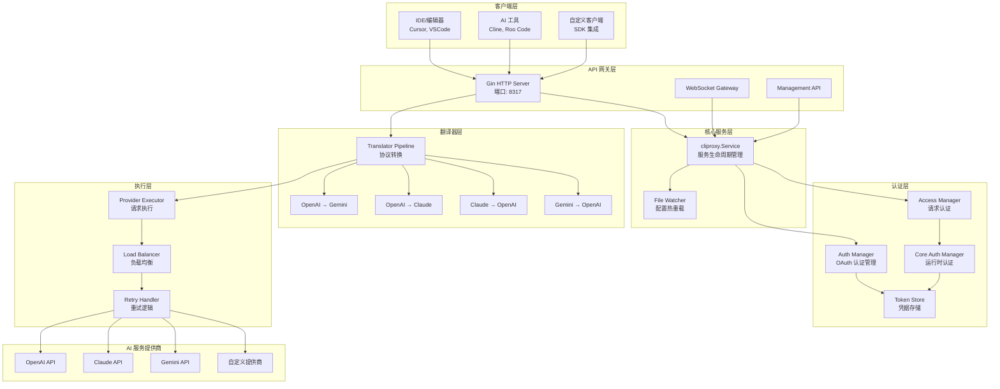

## 核心模块详解

### 1. 服务生命周期管理 (cliproxy.Service)

**位置**: `sdk/cliproxy/service.go`

**职责**:
- 管理整个服务的启动、运行和关闭
- 初始化各个子系统（认证、HTTP 服务器、文件监控等）
- 协调各组件之间的交互
- 处理配置热重载

**核心方法**:
```go
type Service struct {
    cfg            *config.Config
    configPath     string
    tokenProvider  TokenClientProvider
    apiKeyProvider APIKeyClientProvider
    watcherFactory WatcherFactory
    authManager    *sdkAuth.Manager
    accessManager  *sdkaccess.Manager
    coreManager    *coreauth.Manager
    server         *api.Server
}

// Run 启动服务并阻塞直到上下文取消
func (s *Service) Run(ctx context.Context) error

// Shutdown 优雅关闭服务
func (s *Service) Shutdown(ctx context.Context) error
```

**构建器模式**:
```go
service := cliproxy.NewBuilder().
    WithConfig(cfg).
    WithConfigPath(configPath).
    WithLocalManagementPassword(password).
    Build()
```

### 2. HTTP API 服务器 (api.Server)

**位置**: `internal/api/server.go`

**职责**:
- 处理所有 HTTP/HTTPS 请求
- 路由管理
- CORS 中间件
- 请求认证中间件
- 日志记录

**路由结构**:

```mermaid
graph LR
    Root[/] --> V1[/v1]
    Root --> V0[/v0]
    Root --> API[/api]
    
    V1 --> OpenAI_Chat[/chat/completions<br/>OpenAI Chat API]
    V1 --> OpenAI_Model[/models<br/>模型列表]
    V1 --> WS[/ws<br/>WebSocket]
    
    V1 --> Gemini_Models[/:version/:model<br/>Gemini API]
    
    V1 --> Claude_Messages[/messages<br/>Claude API]
    
    V0 --> MGMT[/management<br/>管理 API]
    
    API --> AMP[/provider/:provider/v1<br/>Amp CLI 路由]
```

**核心 Handlers**:
- **OpenAI Handler**: `sdk/api/handlers/openai/`
  - Chat Completions
  - Responses API (o1 系列)
  - 模型列表
  
- **Claude Handler**: `sdk/api/handlers/claude/`
  - Messages API
  
- **Gemini Handler**: `sdk/api/handlers/gemini/`
  - GenerateContent API
  - StreamGenerateContent API
  - CountTokens API

### 3. 认证系统

#### 3.1 认证管理器层次结构

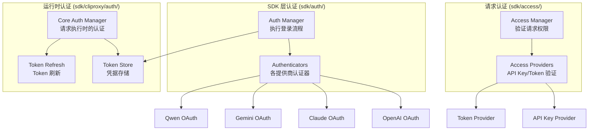

#### 3.2 认证流程

**OAuth 登录流程**:

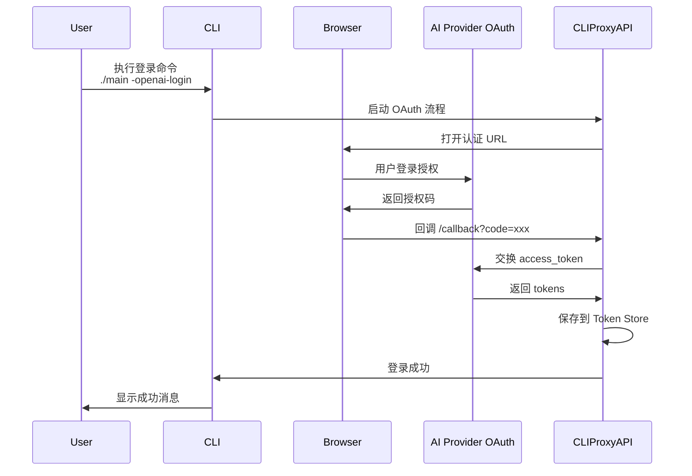

**请求认证流程**:

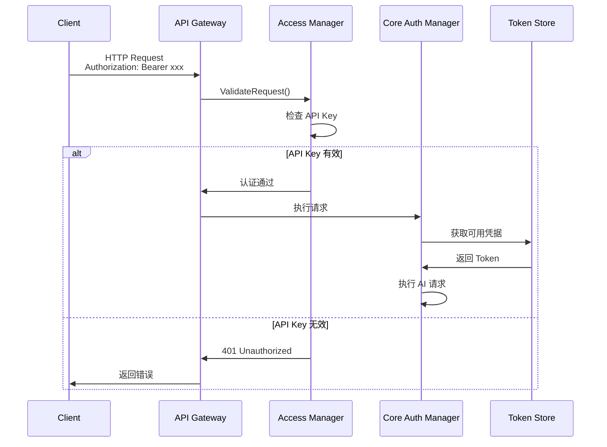

### 4. 翻译器系统 (Translator)

**位置**: `internal/translator/` 和 `sdk/translator/`

**职责**:
- 在不同 AI 服务的请求/响应格式之间进行转换
- 支持流式和非流式转换
- 可插拔的翻译器注册机制

**翻译器管道**:

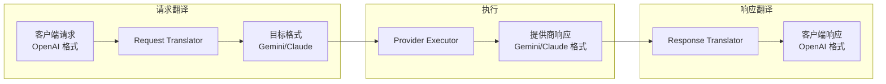

**翻译器注册表**:

| 源协议 | 目标协议 | 翻译器路径 |
|--------|---------|-----------|
| OpenAI | Gemini | `translator/openai/gemini` |
| OpenAI | Claude | `translator/openai/claude` |
| Claude | OpenAI | `translator/claude/openai` |
| Gemini | OpenAI | `translator/gemini/openai` |
| Codex | Claude | `translator/codex/claude` |
| Codex | Gemini | `translator/codex/gemini` |

**核心接口**:
```go
type Translator interface {
    Translate(ctx context.Context, input []byte) ([]byte, error)
}

type StreamTranslator interface {
    TranslateStream(ctx context.Context, input <-chan []byte) <-chan []byte
}
```

### 5. 存储层 (Store)

**位置**: `internal/store/`

**支持的存储后端**:

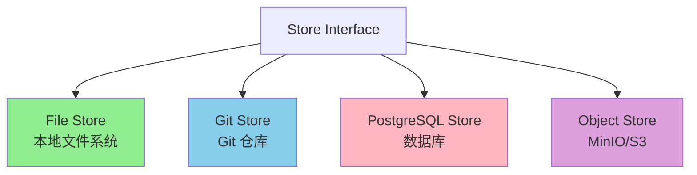

**文件存储结构**:
```
~/.cli-proxy-api/
├── gemini/
│   ├── account1.json
│   └── account2.json
├── openai/
│   ├── account1.json
│   └── account2.json
├── claude/
│   └── account1.json
└── qwen/
    └── account1.json
```

### 6. 负载均衡与重试

#### 6.1 负载均衡策略

**轮询算法**:
```go
type RoundRobinBalancer struct {
    auths   []*Auth
    current int32
}

func (b *RoundRobinBalancer) Next() *Auth {
    idx := atomic.AddInt32(&b.current, 1)
    return b.auths[idx % len(b.auths)]
}
```

#### 6.2 重试机制

**重试条件**:
- HTTP 状态码: 403, 408, 500, 502, 503, 504
- 网络超时
- 提供商限流

**重试策略**:
```yaml
request-retry: 3
max-retry-interval: 30  # 秒
```

**指数退避**:
```go
// 第 n 次重试的等待时间（秒）
waitTime = min(2^n, max-retry-interval)
```

### 7. 监控与日志系统

#### 7.1 日志系统

**位置**: `internal/logging/`

**日志级别**:
- Debug
- Info
- Warn
- Error
- Fatal

**日志输出**:
- 标准输出 (stdout)
- 文件输出 (可选，通过配置启用)

**结构化日志**:
```json
{
  "level": "info",
  "msg": "request completed",
  "method": "POST",
  "path": "/v1/chat/completions",
  "status": 200,
  "latency": "1.23s",
  "client_id": "account1"
}
```

#### 7.2 使用统计

**位置**: `internal/usage/`

**统计指标**:
- 请求数量
- Token 使用量（prompt tokens, completion tokens）
- 错误率
- 响应延迟

**插件系统**:
```go
type Plugin interface {
    OnRequest(ctx context.Context, info *RequestInfo)
    OnResponse(ctx context.Context, info *ResponseInfo)
}
```

## 请求处理流程

### OpenAI Chat Completions 请求流程

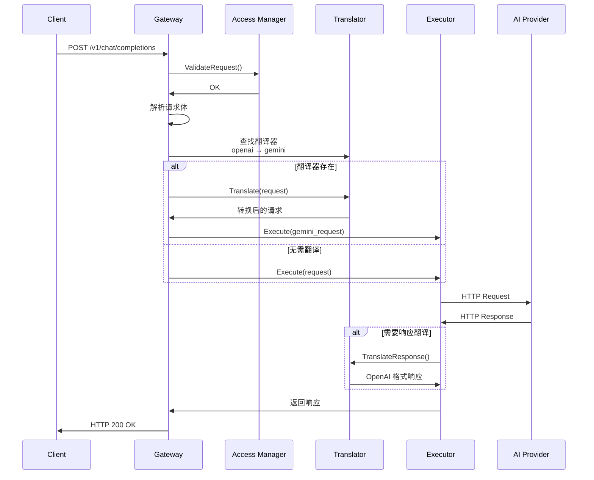

### 流式请求处理流程

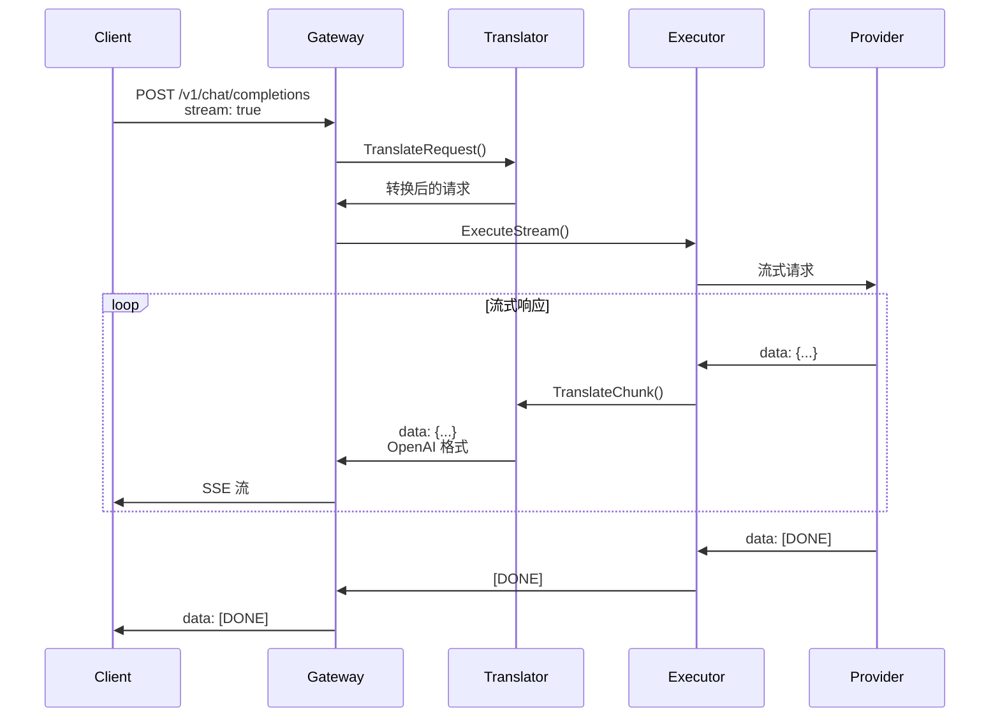

## 认证流程详解

### Token 刷新流程

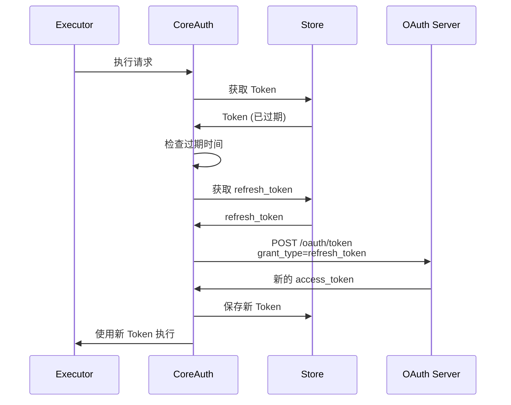

## 配置管理

### 配置文件结构

```yaml
# 服务器配置
port: 8317
tls:
  enable: false
  cert: ""
  key: ""

# 管理 API
remote-management:
  allow-remote: false
  secret-key: ""
  disable-control-panel: false

# 认证目录
auth-dir: "~/.cli-proxy-api"

# API Keys
api-keys:
  - "your-api-key-1"

# 调试和日志
debug: false
logging-to-file: false
usage-statistics-enabled: false

# 代理配置
proxy-url: ""

# 重试配置
request-retry: 3
max-retry-interval: 30

# 配额管理
quota-exceeded:
  switch-project: true
  switch-preview-model: true

# Gemini API Keys
gemini-api-key:
  - api-key: "AIzaSy..."
    base-url: "https://generativelanguage.googleapis.com"
    headers:
      X-Custom-Header: "value"
    proxy-url: "socks5://..."

# Codex API Keys
codex-api-key:
  - api-key: "sk-..."
    base-url: "https://api.openai.com"

# Claude API Keys
claude-api-key:
  - api-key: "sk-ant-..."
    models:
      - name: "claude-3-5-sonnet-20241022"
        alias: "claude-sonnet-latest"

# OpenAI 兼容提供商
openai-compatibility:
  - name: "openrouter"
    base-url: "https://openrouter.ai/api/v1"
    api-key-entries:
      - api-key: "sk-or-v1-..."
    models:
      - name: "deepseek/deepseek-chat"
        alias: "deepseek-chat"

# Payload 配置
payload:
  default:
    - models:
        - name: "gemini-2.5-pro"
      params:
        "generationConfig.temperature": 0.7
  override:
    - models:
        - name: "gpt-*"
      params:
        "reasoning.effort": "high"
```

### 配置热重载

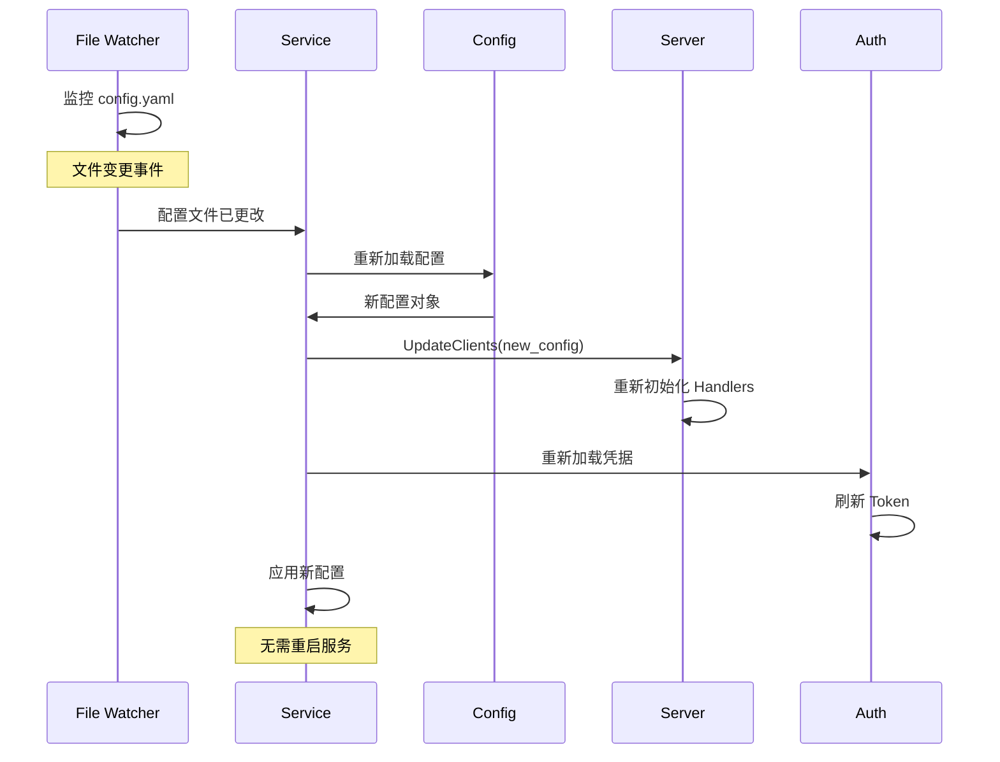

## 数据流转

### 请求数据流

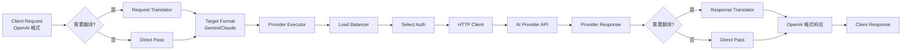

## 安全设计

### 1. 认证安全
- ✅ API Key 认证
- ✅ OAuth 2.0 标准流程
- ✅ Token 安全存储（文件权限 0600）
- ✅ 管理 API 密钥哈希存储
- ✅ 本地管理 API 仅限 localhost（可配置）

### 2. 传输安全
- ✅ 支持 TLS/HTTPS
- ✅ 可配置代理（socks5/http/https）
- ✅ 请求日志脱敏

### 3. 数据隔离
- ✅ 多账户数据隔离
- ✅ 凭据文件独立存储
- ✅ 使用统计按账户分离

## 性能优化

### 1. 连接池
- HTTP 客户端使用连接池
- 可配置最大连接数

### 2. 并发控制
- 使用 context 管理请求生命周期
- 支持请求取消

### 3. 缓存策略
- 模型列表缓存
- 配置缓存

### 4. 流式处理
- 支持 Server-Sent Events (SSE)
- 分块传输编码
- 低内存占用

## 扩展性设计

### 1. 插件化架构
- **翻译器插件**: 注册自定义协议转换器
- **认证插件**: 扩展新的认证方式
- **存储插件**: 接入新的存储后端
- **使用统计插件**: 自定义监控和统计

### 2. SDK 导出
```go
import "github.com/router-for-me/CLIProxyAPI/v6/sdk/cliproxy"

// 使用 SDK 构建自定义服务
service := cliproxy.NewBuilder().
    WithConfig(cfg).
    WithConfigPath(path).
    WithHooks(hooks).
    Build()

service.Run(ctx)
```

### 3. 自定义 Provider
参见 `examples/custom-provider/` 示例。

### 4. 中间件扩展
```go
import "github.com/router-for-me/CLIProxyAPI/v6/internal/api"

option := api.WithMiddleware(customMiddleware)
```

## 总结

CLIProxyAPI 采用了模块化、分层的架构设计，具有以下特点：

1. **高内聚、低耦合**：各模块职责明确，接口清晰
2. **可扩展**：插件化设计，易于扩展新功能
3. **高可用**：多账户负载均衡、自动重试、配额管理
4. **安全**：OAuth 认证、Token 安全存储、传输加密
5. **灵活**：支持多种 AI 服务提供商，协议自动转换
6. **易用**：提供 SDK，便于集成到其他项目
